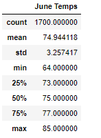
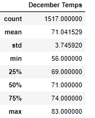

# Surfs_up

## Overview of the Analysis

This project to show investors Oahu temperature summary in June and December, so that the investors can further decide whether the surf and ice cream business can be sustainable all year round. 

## Results

Below are the three key differences between in weather between June and December:
- The average temperature in December is lower than June, this will result in lower sale amount in ice cream business;
- The standard deviation in December is higher than June, indicating the weather varies more in December than June;
- The difference between max and min temperature in December is higher than the difference in June. This further proves that the weather varies more in December.

### Summary

By comparing the temperature in June and December, there is not much difference in temperature all year around. This indicates that if we solely base our decision on temperature, the business should be sustainable all year around, with June’s sale slightly higher than December’s. 

In order to get a better picture on the sustainability of the business, we can create below additional queries:
- We can create a query for precipitation in June and December, since precipitation is a key factor in determining the surf business;
- Instead of only analyzing June and December, we can create a query for all months and show their average temperature.
